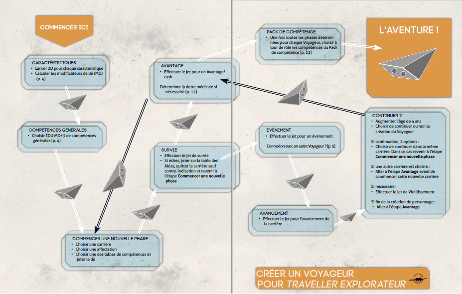

Dans Traveller, vous commencez à 18 ans, vous décidez du type de carrière que vous souhaitez poursuivre et vous participez au déroulement de la vie de votre Voyageur.
L'Édition Explorateur propose deux carrières : Éclaireur et Scientifique, toutes deux idéales pour les aventures et les campagnes d'exploration.
 